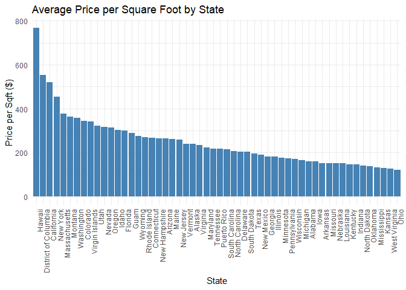
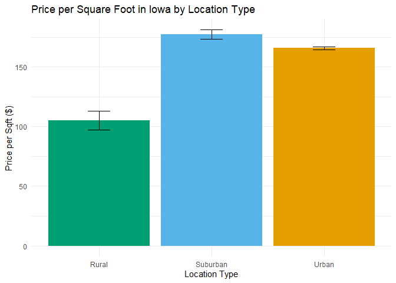
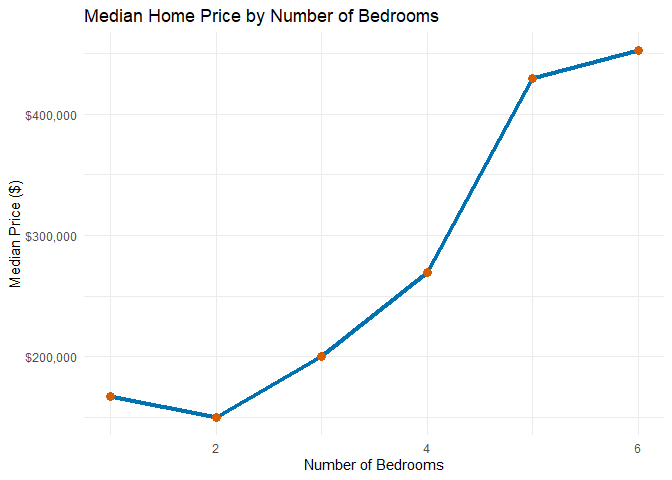
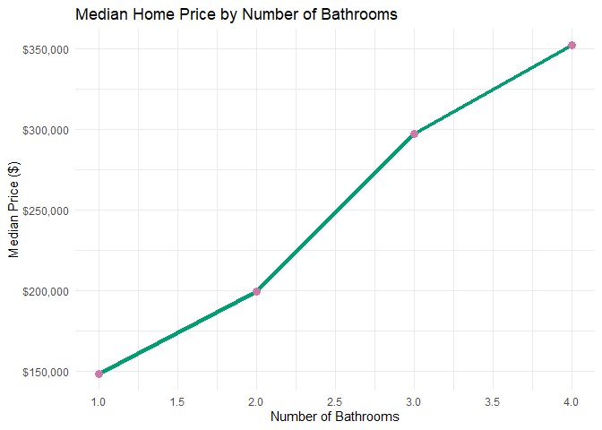

Analysis of Real Estate in the U.S.
================
Aden Koziol

## Data

The dataset `realtor-data.csv` contains information about real estate
listings, including variables such as price, number of
bedrooms/bathrooms, square footage, location, and other relevant
features.

## Data Cleaning

``` r
library(tidyverse)
```

    ## Warning: package 'tidyverse' was built under R version 4.4.3

    ## Warning: package 'tidyr' was built under R version 4.4.3

    ## Warning: package 'readr' was built under R version 4.4.3

    ## Warning: package 'purrr' was built under R version 4.4.3

    ## Warning: package 'forcats' was built under R version 4.4.3

    ## Warning: package 'lubridate' was built under R version 4.4.3

    ## ── Attaching core tidyverse packages ──────────────────────── tidyverse 2.0.0 ──
    ## ✔ dplyr     1.1.4     ✔ readr     2.1.5
    ## ✔ forcats   1.0.0     ✔ stringr   1.5.1
    ## ✔ ggplot2   3.5.1     ✔ tibble    3.2.1
    ## ✔ lubridate 1.9.4     ✔ tidyr     1.3.1
    ## ✔ purrr     1.0.4     
    ## ── Conflicts ────────────────────────────────────────── tidyverse_conflicts() ──
    ## ✖ dplyr::filter() masks stats::filter()
    ## ✖ dplyr::lag()    masks stats::lag()
    ## ℹ Use the conflicted package (<http://conflicted.r-lib.org/>) to force all conflicts to become errors

``` r
library(knitr)

realtor_data <- read_csv("realtor-data.csv")
```

    ## Rows: 2226382 Columns: 12
    ## ── Column specification ────────────────────────────────────────────────────────
    ## Delimiter: ","
    ## chr  (4): status, city, state, zip_code
    ## dbl  (7): brokered_by, price, bed, bath, acre_lot, street, house_size
    ## date (1): prev_sold_date
    ## 
    ## ℹ Use `spec()` to retrieve the full column specification for this data.
    ## ℹ Specify the column types or set `show_col_types = FALSE` to quiet this message.

``` r
# Missing values
missing_values <- colSums(is.na(realtor_data))

# Remove rows with missing critical data (e.g., price, bedrooms)
cleaned_data <- realtor_data %>%
  drop_na(price, bed, bath, house_size)

# Remove duplicates
cleaned_data <- distinct(cleaned_data)

# Convert price to numeric (if stored as character)
cleaned_data <- cleaned_data %>%
  mutate(price = as.numeric(gsub("[\\$,]", "", price)))

# Filter out unrealistic prices (e.g., below $10,000 or above $10M)
cleaned_data <- cleaned_data %>%
  filter(price >= 10000 & price <= 10000000)
```

## Marginal Summaries

``` r
# Summary statistics for numeric variables
summary_stats <- cleaned_data %>%
  select(price, bed, bath, house_size) %>%
  summary()

kable(summary_stats, caption = "Summary Statistics")
```

|     | price           | bed            | bath           | house_size    |
|:----|:----------------|:---------------|:---------------|:--------------|
|     | Min. : 10000    | Min. : 1.000   | Min. : 1.000   | Min. : 4      |
|     | 1st Qu.: 235000 | 1st Qu.: 3.000 | 1st Qu.: 2.000 | 1st Qu.: 1296 |
|     | Median : 375000 | Median : 3.000 | Median : 2.000 | Median : 1747 |
|     | Mean : 544121   | Mean : 3.255   | Mean : 2.491   | Mean : 2026   |
|     | 3rd Qu.: 599000 | 3rd Qu.: 4.000 | 3rd Qu.: 3.000 | 3rd Qu.: 2397 |
|     | Max. :10000000  | Max. :444.000  | Max. :460.000  | Max. :1560780 |

Summary Statistics

``` r
# Distribution of categorical variables (e.g., state, city)
if ("state" %in% colnames(cleaned_data)) {
  state_counts <- cleaned_data %>%
    count(state) %>%
    arrange(desc(n))
  
  kable(state_counts, caption = "Property Count by State")
}
```

| state                |      n |
|:---------------------|-------:|
| California           | 190876 |
| Florida              | 182749 |
| Texas                | 158238 |
| New York             |  67462 |
| Illinois             |  64145 |
| Pennsylvania         |  57841 |
| Arizona              |  56162 |
| Georgia              |  54727 |
| Virginia             |  54368 |
| Washington           |  52330 |
| Ohio                 |  45942 |
| North Carolina       |  42937 |
| Maryland             |  39773 |
| Massachusetts        |  35462 |
| Minnesota            |  35146 |
| Missouri             |  32962 |
| Oklahoma             |  28830 |
| Oregon               |  26355 |
| Michigan             |  25677 |
| New Jersey           |  24069 |
| Colorado             |  24062 |
| South Carolina       |  22326 |
| Wisconsin            |  20736 |
| Alabama              |  20526 |
| Tennessee            |  20163 |
| Iowa                 |  18272 |
| Kentucky             |  17138 |
| Louisiana            |  16808 |
| Indiana              |  12753 |
| New Mexico           |  12554 |
| Arkansas             |  12368 |
| Idaho                |  12284 |
| Connecticut          |  11900 |
| Kansas               |  11687 |
| Nevada               |  11109 |
| Utah                 |  10845 |
| Mississippi          |   8884 |
| West Virginia        |   7915 |
| Rhode Island         |   7696 |
| Delaware             |   7179 |
| Montana              |   6035 |
| District of Columbia |   6022 |
| Hawaii               |   4955 |
| Nebraska             |   4649 |
| North Dakota         |   2547 |
| Maine                |   2439 |
| Puerto Rico          |   2429 |
| New Hampshire        |   2297 |
| South Dakota         |   2293 |
| Wyoming              |   1851 |
| Vermont              |   1573 |
| Alaska               |    900 |
| Guam                 |    264 |
| Virgin Islands       |    204 |

Property Count by State

## Questions To Be Addressed

### How does property price per square foot vary between states?

``` r
# price per square foot
cleaned_data <- cleaned_data %>%
  mutate(price_per_sqft = price / house_size)

# plot
library(ggplot2)

cleaned_data %>%
  group_by(state) %>%
  summarise(avg_price_per_sqft = mean(price_per_sqft, na.rm = TRUE)) %>%
  ggplot(aes(x = reorder(state, -avg_price_per_sqft), y = avg_price_per_sqft)) +
  geom_bar(stat = "identity", fill = "steelblue") +
  labs(
    title = "Average Price per Square Foot by State",
    x = "State",
    y = "Price per Sqft ($)"
  ) +
  theme_minimal() +
  theme(axis.text.x = element_text(angle = 90, hjust = 1))
```

<!-- -->

If we exclude territories, we can see that Hawaii, California, New York,
and Massachusetts have a higher average price per square foot than the
rest of the states while Ohio, West Virginia, Kansas, and Mississippi
have a lower average price per square foot.

EXPLAIN/RESEARCH WHY THIS MAY BE

### How does price per square foot vary between urban, suburban, and rural properties?

``` r
# classify urban, suburban, and rural cities
cleaned_data <- cleaned_data %>%
  mutate(
    location_type = case_when(
      city %in% c("Des Moines", "Cedar Rapids") ~ "Urban",
      city %in% c("North Liberty", "Coralville") ~ "Suburban",
      city %in% c("Elma", "Sac City") ~ "Rural",
      TRUE ~ NA_character_
    )
  ) %>%
  filter(state == "Iowa" & !is.na(location_type)) 

# price per square foot
avg_price_sqft <- cleaned_data %>%
  group_by(location_type) %>%
  summarise(
    avg_price_per_sqft = mean(price_per_sqft, na.rm = TRUE),
    se = sd(price_per_sqft, na.rm = TRUE) / sqrt(n())
  )


# plot
library(ggplot2)

ggplot(avg_price_sqft, aes(x = location_type, y = avg_price_per_sqft, fill = location_type)) +
  geom_bar(stat = "identity") +
  geom_errorbar(
    aes(ymin = avg_price_per_sqft - se, ymax = avg_price_per_sqft + se),
    width = 0.2,
    color = "black"
  ) +
  scale_fill_manual(values = c("Urban" = "#E69F00", "Suburban" = "#56B4E9", "Rural" = "#009E73")) +
  labs(
    title = "Price per Square Foot in Iowa by Location Type",
    x = "Location Type",
    y = "Price per Sqft ($)",
    fill = "Location Type"
  ) +
  theme_minimal() +
  theme(legend.position = "none")
```

<!-- -->

We can see that rural cities have a much lower average price per square
foot than both urban and suburban cities. Suburban cities do have a
slightly higher average price per square foot than urban cities.

EXPLAIN/RESEARCH WHY THIS MAY BE

### How does the number of bedrooms affect price?

``` r
# Median price by bedrooms 1 - 6
bedroom_price <- cleaned_data %>%
  filter(bed %in% 1:6) %>%
  group_by(bed) %>%
  summarise(median_price = median(price, na.rm = TRUE))

# plot
ggplot(bedroom_price, aes(x = bed, y = median_price)) +
  geom_line(color = "#0072B2", linewidth = 1.5) +
  geom_point(size = 3, color = "#D55E00") +
  scale_y_continuous(labels = scales::dollar) +
  labs(
    title = "Median Home Price by Number of Bedrooms",
    x = "Number of Bedrooms",
    y = "Median Price ($)"
  ) +
  theme_minimal()
```

<!-- -->

### How does the number of bathrooms affect price?

``` r
# median price of bathrooms 1-4
bathroom_price <- cleaned_data %>%
  mutate(bath_rounded = round(bath * 2) / 2) %>%  # Group as 1, 1.5, 2, etc.
  filter(bath_rounded %in% c(1, 1.5, 2, 2.5, 3, 3.5, 4)) %>%
  group_by(bath_rounded) %>%
  summarise(median_price = median(price, na.rm = TRUE))

# Line chart
ggplot(bathroom_price, aes(x = bath_rounded, y = median_price)) +
  geom_line(color = "#009E73", linewidth = 1.5) +
  geom_point(size = 3, color = "#CC79A7") +
  scale_y_continuous(labels = scales::dollar) +
  scale_x_continuous(breaks = seq(1, 4, by = 0.5)) +
  labs(
    title = "Median Home Price by Number of Bathrooms",
    x = "Number of Bathrooms",
    y = "Median Price ($)"
  ) +
  theme_minimal()
```

<!-- -->
