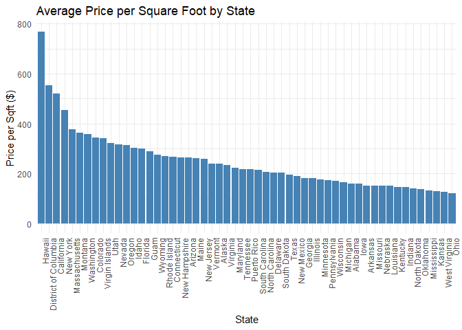

Analysis of Real Estate in the U.S.
================
Aden Koziol

## Data

- Kaggle dataset with real estate listings across the U.S.

- Over 2 Million Entries

- Columns: Status, Price, Bed, Bath, Acre, City, State, Zip Code, Square
  Feet

## Data Cleaning

``` r
library(tidyverse)
```

    ## Warning: package 'tidyverse' was built under R version 4.4.3

    ## Warning: package 'tidyr' was built under R version 4.4.3

    ## Warning: package 'readr' was built under R version 4.4.3

    ## Warning: package 'purrr' was built under R version 4.4.3

    ## Warning: package 'forcats' was built under R version 4.4.3

    ## Warning: package 'lubridate' was built under R version 4.4.3

    ## ── Attaching core tidyverse packages ──────────────────────── tidyverse 2.0.0 ──
    ## ✔ dplyr     1.1.4     ✔ readr     2.1.5
    ## ✔ forcats   1.0.0     ✔ stringr   1.5.1
    ## ✔ ggplot2   3.5.1     ✔ tibble    3.2.1
    ## ✔ lubridate 1.9.4     ✔ tidyr     1.3.1
    ## ✔ purrr     1.0.4     
    ## ── Conflicts ────────────────────────────────────────── tidyverse_conflicts() ──
    ## ✖ dplyr::filter() masks stats::filter()
    ## ✖ dplyr::lag()    masks stats::lag()
    ## ℹ Use the conflicted package (<http://conflicted.r-lib.org/>) to force all conflicts to become errors

``` r
library(knitr)

realtor_data <- read_csv("realtor-data.csv")
```

    ## Rows: 2226382 Columns: 12
    ## ── Column specification ────────────────────────────────────────────────────────
    ## Delimiter: ","
    ## chr  (4): status, city, state, zip_code
    ## dbl  (7): brokered_by, price, bed, bath, acre_lot, street, house_size
    ## date (1): prev_sold_date
    ## 
    ## ℹ Use `spec()` to retrieve the full column specification for this data.
    ## ℹ Specify the column types or set `show_col_types = FALSE` to quiet this message.

``` r
# Missing values
missing_values <- colSums(is.na(realtor_data))

# Remove rows with missing critical data (e.g., price, bedrooms)
cleaned_data <- realtor_data %>%
  drop_na(price, bed, bath, house_size)

# Remove duplicates
cleaned_data <- distinct(cleaned_data)

# Convert price to numeric (if stored as character)
cleaned_data <- cleaned_data %>%
  mutate(price = as.numeric(gsub("[\\$,]", "", price)))

# Filter out unrealistic prices (e.g., below $10,000 or above $10M)
cleaned_data <- cleaned_data %>%
  filter(price >= 10000 & price <= 10000000)
```

## Questions To Be Addressed

### How does property price per square foot vary between states?

``` r
# price per square foot
cleaned_data <- cleaned_data %>%
  mutate(price_per_sqft = price / house_size)

# plot
library(ggplot2)

cleaned_data %>%
  group_by(state) %>%
  summarise(avg_price_per_sqft = mean(price_per_sqft, na.rm = TRUE)) %>%
  ggplot(aes(x = reorder(state, -avg_price_per_sqft), y = avg_price_per_sqft)) +
  geom_bar(stat = "identity", fill = "steelblue") +
  labs(
    title = "Average Price per Square Foot by State",
    x = "State",
    y = "Price per Sqft ($)"
  ) +
  theme_minimal() +
  theme(axis.text.x = element_text(angle = 90, hjust = 1))
```

<!-- -->

- Hawaii, California, New York, and Massachusetts have the highest
  average price per square foot.

- Ohio, West Virginia, Kansas, and Mississippi have the lowest average
  price per square foot.

- Price per square foot is likely affected by desirability, large
  cities, and job markets.

### How does price per square foot vary between urban, suburban, and rural properties?

``` r
# classify urban, suburban, and rural cities
cleaned_data <- cleaned_data %>%
  mutate(
    location_type = case_when(
      city %in% c("Des Moines", "Cedar Rapids") ~ "Urban",
      city %in% c("North Liberty", "Coralville") ~ "Suburban",
      city %in% c("Elma", "Sac City") ~ "Rural",
      TRUE ~ NA_character_
    )
  ) %>%
  filter(state == "Iowa" & !is.na(location_type)) 

# price per square foot
avg_price_sqft <- cleaned_data %>%
  group_by(location_type) %>%
  summarise(
    avg_price_per_sqft = mean(price_per_sqft, na.rm = TRUE),
    se = sd(price_per_sqft, na.rm = TRUE) / sqrt(n())
  )


# plot
library(ggplot2)

ggplot(avg_price_sqft, aes(x = location_type, y = avg_price_per_sqft, fill = location_type)) +
  geom_bar(stat = "identity") +
  geom_errorbar(
    aes(ymin = avg_price_per_sqft - se, ymax = avg_price_per_sqft + se),
    width = 0.2,
    color = "black"
  ) +
  scale_fill_manual(values = c("Urban" = "#E69F00", "Suburban" = "#56B4E9", "Rural" = "#009E73")) +
  labs(
    title = "Price per Square Foot in Iowa by Location Type",
    x = "Location Type",
    y = "Price per Sqft ($)",
    fill = "Location Type"
  ) +
  theme_minimal() +
  theme(legend.position = "none")
```

<!-- -->

- Used cities Des Moines, Cedar Rapids, North Liberty, Coralville, Elma,
  and Sac City.

- Rural properties have a much lower price per square foot.

- Suburban properties have a slightly higher price per square foot than
  urban properties.

- Rural areas are less expensive likely because of a lesser population
  density and fewer jobs.

- Suburban areas are likely more expensive than urban areas because of
  higher acres and better schools.

### How does the number of bedrooms affect price?

``` r
# Median price by bedrooms 1 - 6
bedroom_price <- cleaned_data %>%
  filter(bed %in% 1:6) %>%
  group_by(bed) %>%
  summarise(median_price = median(price, na.rm = TRUE))

# plot
ggplot(bedroom_price, aes(x = bed, y = median_price)) +
  geom_line(color = "#0072B2", linewidth = 1.5) +
  geom_point(size = 3, color = "#D55E00") +
  scale_y_continuous(labels = scales::dollar) +
  labs(
    title = "Median Home Price by Number of Bedrooms",
    x = "Number of Bedrooms",
    y = "Median Price ($)"
  ) +
  theme_minimal()
```

<!-- -->

- This graph is not linear.

- Average bedroom add on is \$50,000. - Fixr

- Adding a 4th or 5th bedroom to a home is worth it.

### How does the number of bathrooms affect price?

``` r
# median price of bathrooms 1-4
bathroom_price <- cleaned_data %>%
  mutate(bath_rounded = round(bath * 2) / 2) %>%  # Group as 1, 1.5, 2, etc.
  filter(bath_rounded %in% c(1, 1.5, 2, 2.5, 3, 3.5, 4)) %>%
  group_by(bath_rounded) %>%
  summarise(median_price = median(price, na.rm = TRUE))

# Line chart
ggplot(bathroom_price, aes(x = bath_rounded, y = median_price)) +
  geom_line(color = "#009E73", linewidth = 1.5) +
  geom_point(size = 3, color = "#CC79A7") +
  scale_y_continuous(labels = scales::dollar) +
  scale_x_continuous(breaks = seq(1, 4, by = 0.5)) +
  labs(
    title = "Median Home Price by Number of Bathrooms",
    x = "Number of Bathrooms",
    y = "Median Price ($)"
  ) +
  theme_minimal()
```

<!-- -->

- The trend of this graph is pretty linear.

- Bathroom add on is on average \$35,000. - Angi’s List

- Adding another bathroom to a home seems to increase the price by about
  \$50,000.

## Conclusions

- More desirable locations, larger cities, and better job markets
  increase the price per square foot of a property.

- Rural areas have a cheaper price per square foot than urban and
  suburban areas.

- Adding a 4th or 5th bedroom to a home is a good investment.

- Adding a bathroom to a home is a good investment.

## Sources

Bedroom addition cost: Cost to add a bedroom. Fixr. (n.d.).
<https://www.fixr.com/costs/bedroom-addition>

Hisaka, M. (2024, December 15). How much does it cost to add a bathroom
in 2025?. Angi.
<https://www.angi.com/articles/how-much-does-it-cost-add-bathroom.htm>
